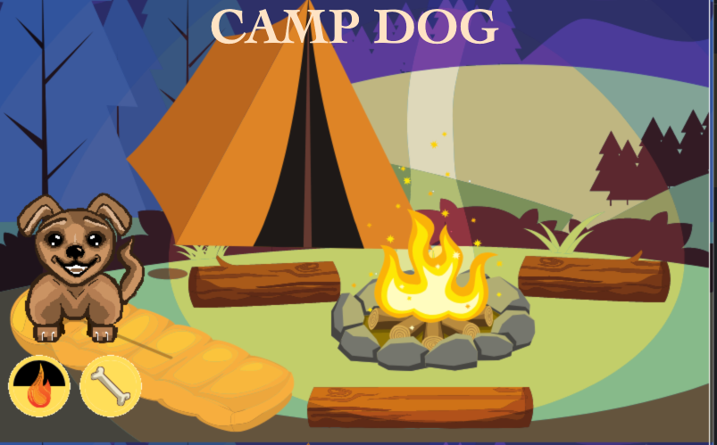
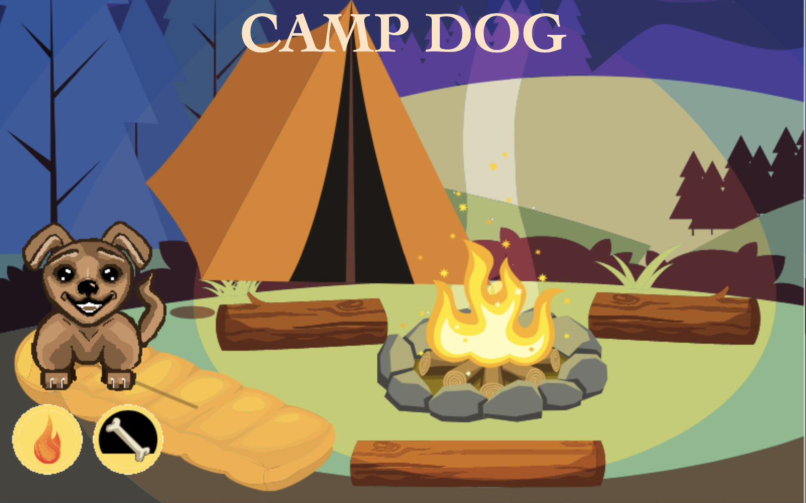
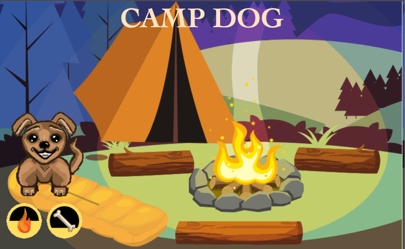

# **CAMP DOG**

A random dog has walked in from the woods surrounding you. It's October and the nights are starting to get really cold. The dog seems to have been attracted to you're fire.  He's a bit mangy and dirty but he also looks pretty hungry. You reach towards your leftovers, there are a few bones you could toss over from the game you've been cooking yourself. But as you turn towards the remains, you find yourself face to face with a raccoon! Before you can even react, the dog scares the raccoon away. You nod approvingly, toss him a bone, and he rests by the fire.

 Camp Dog is helping protect you from the wild animals surrounding you. He's not necessarily friendly, but as long as you toss him a bone on occasion and keep your fire going, camp dog will stick around. 
 
## _Game Instructions_

Simply press the **Fire** button to raise the warmth meter, 

and press the **Bone** button as as the meters run down down. 

The faster you press, the faster the meter fills.

 If the fire is not kept up or if camp dog doesn't get enough bones, comma he will take off. However, if you manage to befriend Camp Dog for  A certain amount of time, Enough time to gain his trust, You will be in for a surprise!

 Get ready to befriend the wild beast that is CAMP DOG to find out more about him!
 
 Link here:

 [_Play_ **CAMP DOG** _now_!](https://camp-dog-app.netlify.app/)
